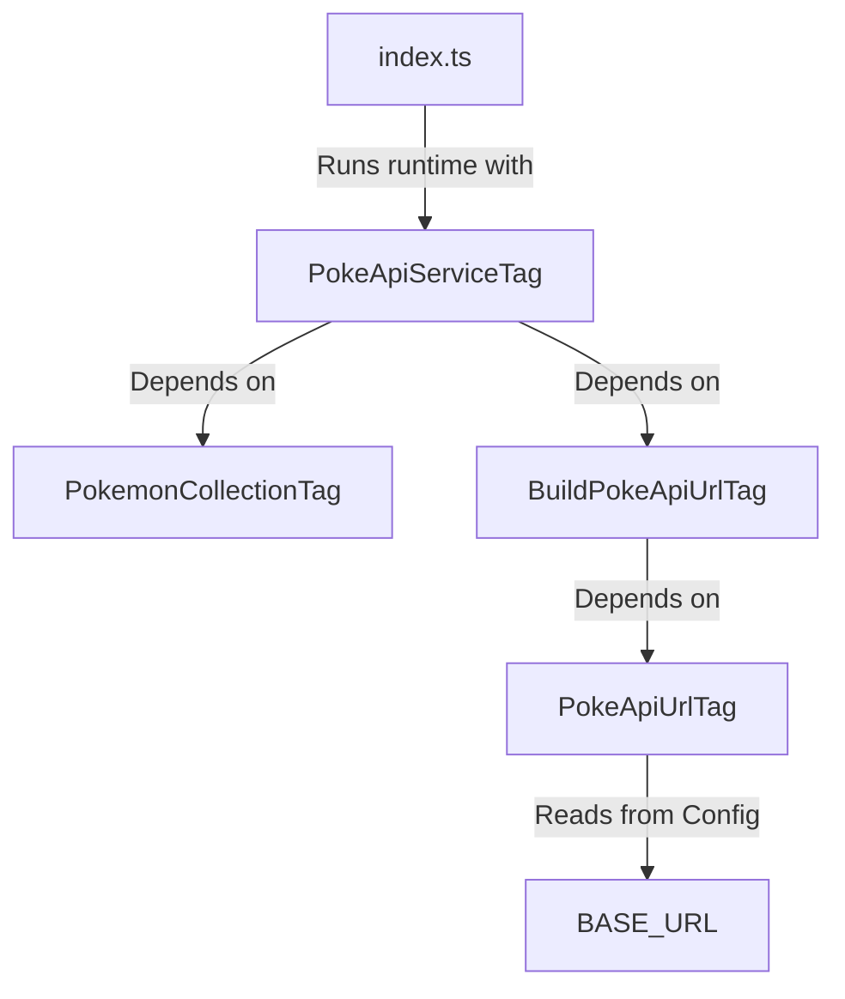

# Effect-TS PokeAPI Experiment

A structured sandbox project exploring dependency injection, schema validation, configuration loading, and unit testing using the modern **Effect-TS** (v3) ecosystem in TypeScript.

---

## 🛠️ Tech Stack

- **Core Framework**: [Effect-TS (v3)](https://effect.website/) - A fully-typed functional programming library for TypeScript to handle dependency injection, error recovery, configuration, and effects.
- **Language**: [TypeScript (v6)](https://www.typescriptlang.org/)
- **Runtime Tooling**: [tsx](https://github.com/privatenumber/tsx) (TypeScript execute)
- **Formatting & Linting**: [Biome](https://biomejs.dev/) - A fast, modern all-in-one tool for formatting and linting.
- **Testing Framework**: [Vitest](https://vitest.dev/)
- **HTTP Mocking**: [Mock Service Worker (MSW)](https://mswjs.io/) - Used to intercept and mock network responses during testing.

---

## 📋 Project Summary

**This project is just a tutorial I followed to understand the basic of effect-ts.**
This project showcases a production-ready architectural pattern for building applications using Effect-TS. It implements a service-oriented hierarchy to fetch Pokemon details from the PokeAPI.

The application follows the classic Effect-TS design:
1. **Defining Schemas**: Strict runtime validation of fetched data using `Schema.Class`.
2. **Custom Error Modelling**: Type-safe error channels leveraging `Data.TaggedError`.
3. **Class-based Services**: Modular components defined using `Effect.Service` and resolved via a container pattern.
4. **Environment Configuration**: Robust environment variable parsing with `Config`.
5. **Clean Testing Boundaries**: Mocking external services and custom config providers within unit tests, isolating network calls using MSW.

---

## 🏛️ Architecture & Service Hierarchy

The services in this project form a dependency graph resolved at runtime by the `ManagedRuntime` in the entry point.



### Dependency Injection Breakdown:
- **`PokeApiServiceTag`**: The top-level service exposing the `getPokemon` effect.
- **`PokemonCollectionTag`**: Provides a static list of Pokemon names to choose from.
- **`BuildPokeApiUrlTag`**: A service that exposes a function to format the request URL.
- **`PokeApiUrlTag`**: Resolves the base URL from the `BASE_URL` environment configuration.

---

## file-system Codebase Map

### Production Code (`src/`)

- [index.ts](file:///home/harry-lew/Coding/effect-ts-experiment/src/index.ts): The entry point. Creates a `ManagedRuntime` combining the required services and runs the main program. Handles error recovery via `Effect.catchTags`.
- [PokeApi.ts](file:///home/harry-lew/Coding/effect-ts-experiment/src/PokeApi.ts): Implements the primary `PokeApiServiceTag` using class-based services (`Effect.Service`). Encapsulates the network fetch and schema decoding logic.
- [BuildPokeApiUrl.ts](file:///home/harry-lew/Coding/effect-ts-experiment/src/BuildPokeApiUrl.ts): Implements `BuildPokeApiUrlTag` to formulate the complete HTTP endpoint.
- [PokeApiUrl.ts](file:///home/harry-lew/Coding/effect-ts-experiment/src/PokeApiUrl.ts): Reads the `BASE_URL` environment variable via `Config.string` and constructs the base PokeAPI endpoint.
- [PokemonCollection.ts](file:///home/harry-lew/Coding/effect-ts-experiment/src/PokemonCollection.ts): Exposes a static collection of Pokemon names (`PokemonCollectionTag`).
- [schemas.ts](file:///home/harry-lew/Coding/effect-ts-experiment/src/schemas.ts): Validates incoming JSON structure into a typed `Pokemon` class using `Schema.Class`.
- [error.ts](file:///home/harry-lew/Coding/effect-ts-experiment/src/error.ts): Defines custom domain error classes (`FetchError`, `JsonError`) using `Data.TaggedError` for strict type matching.

### Test Code (`test/`)

- [pokeApiUrl.test.ts](file:///home/harry-lew/Coding/effect-ts-experiment/test/pokeApiUrl.test.ts): Verifies the program using a testing runtime. Replaces the default `ConfigProvider` to mock `BASE_URL` to point to localhost.
- [setup.ts](file:///home/harry-lew/Coding/effect-ts-experiment/test/setup.ts): Configures global lifecycle hooks for Vitest to spin up, reset, and teardown the MSW mock server.
- [node.ts](file:///home/harry-lew/Coding/effect-ts-experiment/test/node.ts): Configures the MSW server using the defined handlers.
- [handlers.ts](file:///home/harry-lew/Coding/effect-ts-experiment/test/handlers.ts): Declares HTTP interceptors for mocking responses from `http://localhost:3000/api/v2/pokemon/*`.

---

## 🚀 Running the Project

Ensure you have [pnpm](https://pnpm.io/) installed.

### Install Dependencies
```bash
pnpm install
```

### Run in Development
Execute the entry point with a local mock environment variable:
```bash
pnpm run dev
```

### Run Tests
Execute the Vitest test suite:
```bash
pnpm run test
```

### Run Typechecking
```bash
pnpm run tsc
```

### Code Style (Format & Lint)
Format and lint checking is managed by Biome:
```bash
pnpm exec biome check .
```
